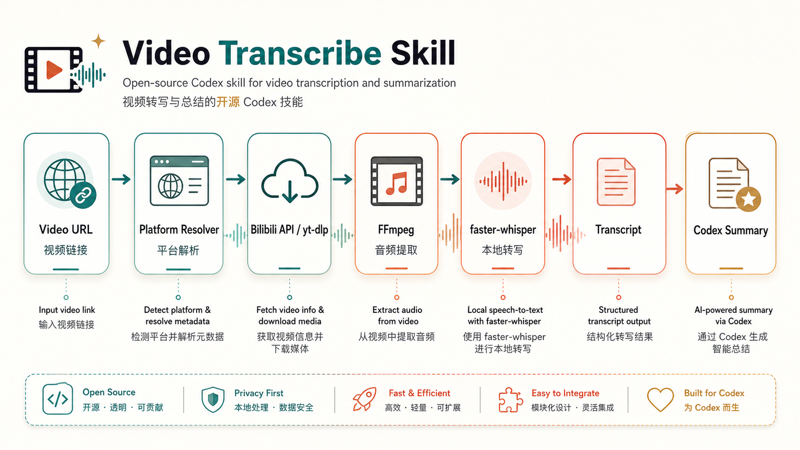

# Technical Route / 技术路线

English | [中文](#中文)



## Goal

The skill turns a video link into text that Codex can reason over while staying offline-first and lightweight. It is not a hosted transcription service and does not add a backend. Platform routing, downloads, retries, audio conversion, and file checks stay in deterministic code. The language model only consumes the transcript to summarize, classify, extract, or answer questions.

## Pipeline

```text
User video link
  -> platform resolver
  -> audio extractor
  -> ffmpeg normalization
  -> faster-whisper local ASR
  -> transcript.txt + metadata.json
  -> Codex summary or extraction
```

## Platform Routing

### Bilibili

For Bilibili URLs and BV ids, the script avoids `yt-dlp` because Bilibili often blocks that path. It uses:

1. `https://api.bilibili.com/x/web-interface/view?bvid=...`
   - resolves title, `cid`, and metadata.
2. `https://api.bilibili.com/x/player/playurl?...&fnval=16`
   - returns DASH streams.
3. highest-bandwidth audio stream
   - downloaded with a browser-like User-Agent and video Referer.

### YouTube and Generic URLs

For non-Bilibili URLs, the script delegates extraction to `yt-dlp`:

```text
yt-dlp --no-playlist -f bestaudio/best -o source.%(ext)s URL
```

This keeps support broad without duplicating every platform extractor.

### Local Files

When the input path exists locally, the script skips platform routing and sends the file directly to FFmpeg.

## Audio Normalization

The script converts every source to a stable Whisper input:

```text
ffmpeg -y -hide_banner -loglevel error -i INPUT -ar 16000 -ac 1 audio.wav
```

This produces 16 kHz mono PCM audio, which keeps transcription behavior consistent across platform formats.

## Transcription

The script uses `faster-whisper`:

```python
WhisperModel(model_name, device="cpu", compute_type="int8")
```

Default model: `base`.

Recommended language options:

- `--language auto` for unknown language.
- `--language zh` for Chinese videos when auto-detection or mixed English terms cause unstable output.
- `--model small` for better quality when speed is less important.

## Output Contract

The script writes:

- `audio.wav`: normalized audio.
- `transcript.txt`: one timestamped segment per line.
- `metadata.json`: source, platform, title, model, language, output paths, and segment count.

Example transcript line:

```text
[041.56-042.16] 第一步
```

## Error Handling

The script fails loudly for missing deterministic dependencies:

- missing `ffmpeg`
- missing `yt-dlp` for generic URLs
- missing `faster-whisper`
- Bilibili API returns no audio stream

The agent should report the exact blocker rather than claiming the video was processed.

## Design Principle

Do not ask the language model whether to retry, how to route platforms, or whether a download succeeded. Code handles those states. The model starts after transcript text exists.

---

## 中文

## 目标

这个 skill 把视频链接变成 Codex 能读取和推理的文本。平台路由、下载、重试、音频转换和文件校验都交给确定性代码；语言模型只在拿到转写文本后做摘要、分类、提取或问答。

## 流程

```text
用户视频链接
  -> 平台识别
  -> 音频提取
  -> ffmpeg 标准化
  -> faster-whisper 本地 ASR
  -> transcript.txt + metadata.json
  -> Codex 摘要或提取
```

## 平台路由

### B 站

对于 B 站链接和 BV 号，脚本不使用 `yt-dlp`，因为这条路线经常被 B 站风控拦截。脚本使用：

1. `https://api.bilibili.com/x/web-interface/view?bvid=...`
   - 获取标题、`cid` 和元数据。
2. `https://api.bilibili.com/x/player/playurl?...&fnval=16`
   - 获取 DASH 流。
3. 选择最高码率音频流
   - 使用浏览器 User-Agent 和视频 Referer 下载。

### YouTube 和通用链接

对于非 B 站链接，脚本交给 `yt-dlp`：

```text
yt-dlp --no-playlist -f bestaudio/best -o source.%(ext)s URL
```

这样可以复用成熟平台适配能力，而不是在脚本里重复实现每个平台。

### 本地文件

如果输入是本地存在的文件路径，脚本跳过平台路由，直接交给 FFmpeg。

## 音频标准化

脚本把所有来源统一转换成 Whisper 稳定输入：

```text
ffmpeg -y -hide_banner -loglevel error -i INPUT -ar 16000 -ac 1 audio.wav
```

输出是 16 kHz 单声道 PCM 音频，减少平台格式差异对转写的影响。

## 转写

脚本使用 `faster-whisper`：

```python
WhisperModel(model_name, device="cpu", compute_type="int8")
```

默认模型：`base`。

推荐语言参数：

- 不确定语言时用 `--language auto`。
- 中文视频建议用 `--language zh`，尤其是中英混合专名较多时。
- 如果更重视质量而不是速度，可以用 `--model small`。

## 输出约定

脚本输出：

- `audio.wav`：标准化音频。
- `transcript.txt`：每行一个带时间戳的转写片段。
- `metadata.json`：来源、平台、标题、模型、语言、输出路径和片段数。

转写行示例：

```text
[041.56-042.16] 第一步
```

## 错误处理

脚本对确定性依赖缺失直接失败：

- 缺少 `ffmpeg`
- 通用链接缺少 `yt-dlp`
- 缺少 `faster-whisper`
- B 站 API 没有返回音频流

Agent 应该报告明确 blocker，而不是假装已经处理视频。

## 设计原则

不要让语言模型决定是否重试、走哪个平台路线、下载是否成功。这些状态由代码处理。模型只在转写文本已经存在之后介入。
